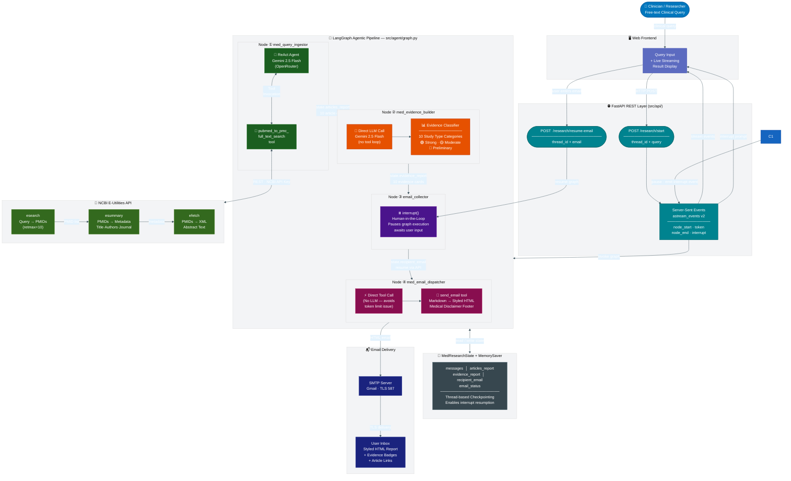
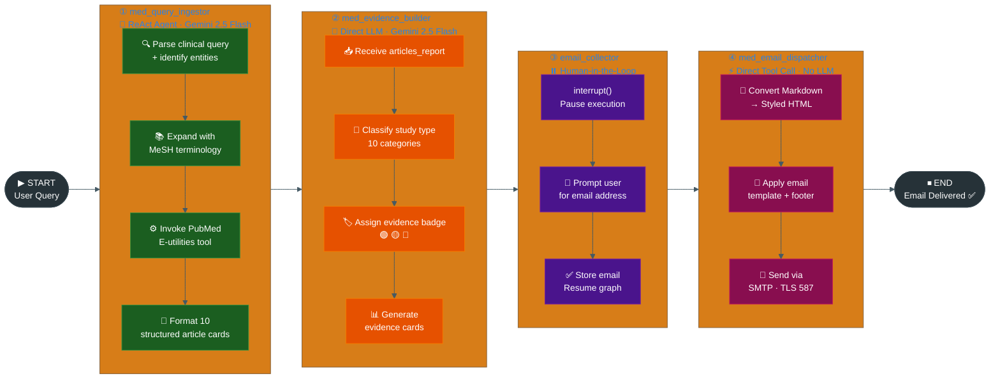
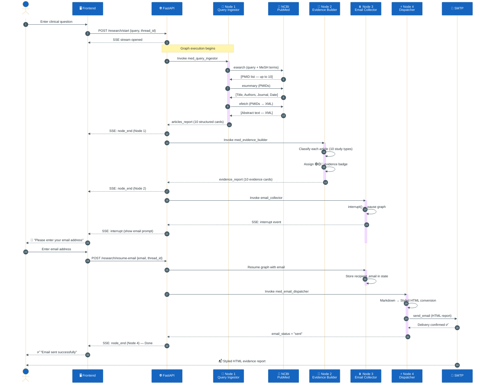
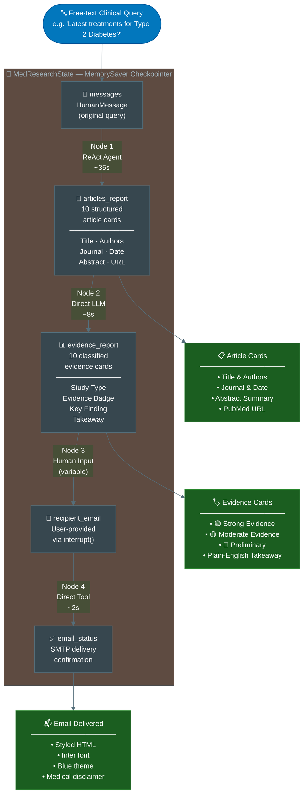
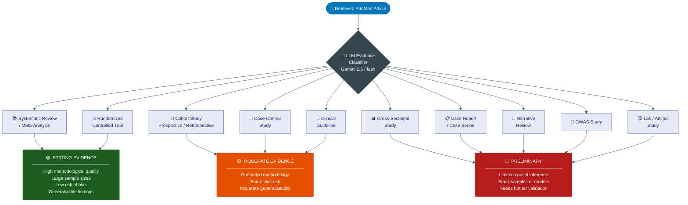
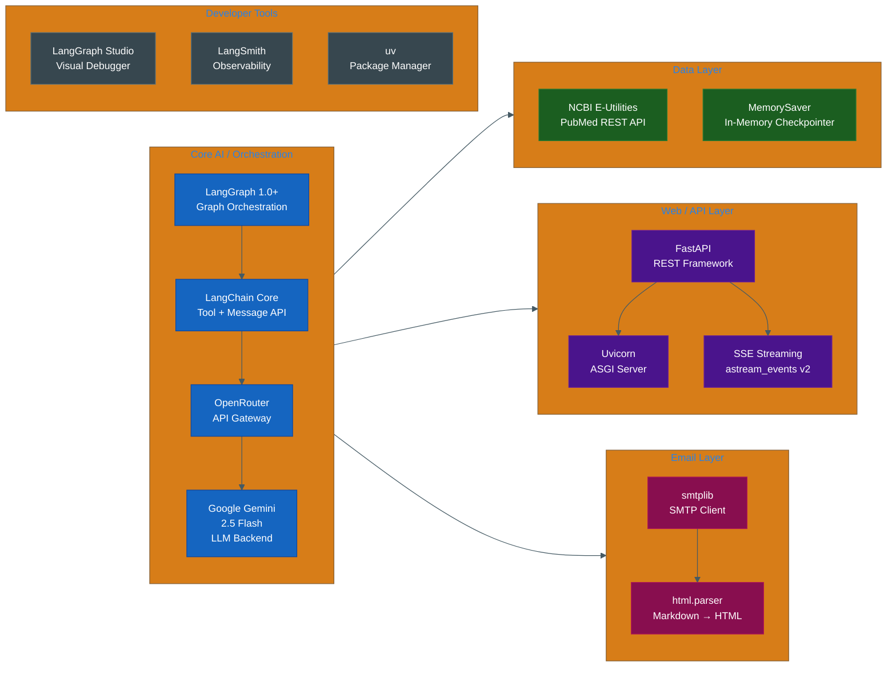

# MedGraph — System Architecture Diagrams

---

## Figure 1: Complete System Architecture (Full Color)

---

## Figure 2: Four-Node Sequential Pipeline (Left → Right)

---

## Figure 3: End-to-End Sequence Diagram

---

## Figure 4: State Data Flow Through Pipeline

---

## Figure 5: Evidence Classification Taxonomy

---

## Figure 6: Technology Stack

---

## How to Export as High-Quality PNG/SVG

### Option 1: Mermaid Live Editor (Recommended for Paper)
1. Go to **mermaid.live**
2. Paste any diagram code block
3. Click **PNG** or **SVG** — download
4. Use SVG for best print quality

### Option 2: VS Code Preview
1. Install: **Markdown Preview Mermaid Support**
2. Open this file → Press `Ctrl+Shift+V`
3. Right-click any diagram → Save Image

### Option 3: GitHub Auto-Render
Push to GitHub — all diagrams render automatically in `.md` files.

---

**For Paper Submission:**
- Use **Figure 1** as main architecture diagram
- Use **Figure 2** as pipeline flow figure
- Use **Figure 3** as sequence diagram in Implementation section
- Use **Figure 5** as evidence taxonomy in System Design section
